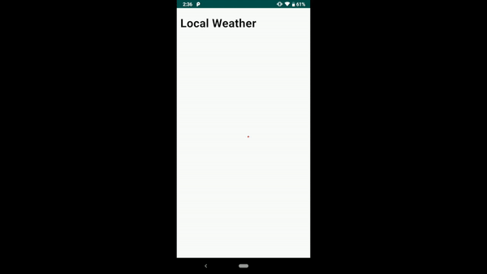

## Idus Coding Test

MetaWeather의 open Api를 활용한 날씨 어플리케이션

## Demo

## 사용된 라이브러리
1. [Retrofit](https://github.com/square/retrofit)
2. [Glide](https://github.com/bumptech/glide)
3. [Koin](https://github.com/InsertKoinIO/koin)
4. [RxJava](https://github.com/ReactiveX/RxJava)
5. [Android Architecture Component](https://developer.android.com/topic/libraries/architecture/)

